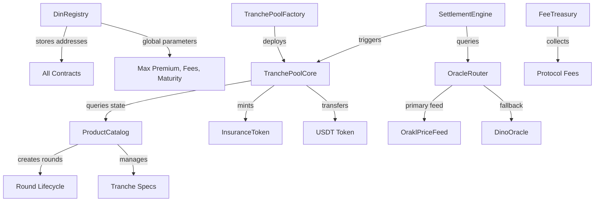

# DIN Protocol Smart Contract Integration & Package Architecture

## Overview

This document provides a comprehensive guide for integrating DIN Protocol smart contracts into the application ecosystem. It covers both the contract architecture and the design of a dedicated `@dinsure/contracts` package that serves as the single source of truth for all blockchain interactions.

## Table of Contents

1. [Smart Contract Architecture](#smart-contract-architecture)
2. [Package Design & Structure](#package-design--structure)
3. [Implementation Strategy](#implementation-strategy)
4. [Service Layer Architecture](#service-layer-architecture)
5. [Integration Patterns](#integration-patterns)
6. [Type System](#type-system)
7. [Error Handling](#error-handling)
8. [Testing Strategy](#testing-strategy)
9. [Security & Performance](#security--performance)

## Smart Contract Architecture

### Deployed Contracts (Kaia Testnet - Chain ID: 1001)

All contracts are deployed and verified on Kaia Kairos testnet. The deployment uses Hardhat Ignition for deterministic and reproducible deployments.

| Contract | Address | Purpose |
| **DinRegistry** | `0x0000760e713fed5b6F866d3Bad87927337DF61c0` | Central registry for all contract addresses and global parameters |
| **ProductCatalog** | `0x5c251A3561E47700a9bcbD6ec91e61fB52Eb50d2` | Manages products, tranches, and rounds |
| **InsuranceToken** | `0x147f4660515aE91c81FdB43Cf743C6faCACa9903` | ERC721 NFT representing insurance positions |
| **TranchePoolFactory** | `0x563e95673d4210148eD59eDb6310AC7d488F5Ec0` | Deploys isolated pools for each tranche |
| **SettlementEngine** | `0xAE3FA73652499Bf0aB0b79B8C309DD62137f142D` | Handles claim processing and settlement |
| **OracleRouter** | `0x5d83444EBa6899f1B7abD34eF04dDF7Dd7b38a37` | Oracle system router |
| **OraklPriceFeed** | `0x1320682DCe0b0A52A09937d19b404901d32D5f68` | Primary price feed oracle |
| **DinoOracle** | `0x2480108C0dA6F7563a887D7d9d969630529340dD` | Secondary oracle source |
| **DinUSDT** | `0x53232164780a589dfAe08fB16D1962bD78591Aa0` | Test USDT token |
| **DinToken** | `0x01200e08D6C522C288bE660eb7E8c82d5f095a42` | Protocol governance token |
| **FeeTreasury** | `0x9C20316Ba669e762Fb43dbb6d3Ff63062b89945D` | Protocol fee collection |

### Contract Relationships



### Insurance Flow Architecture

#### Product & Tranche Creation
1. **Product Registration**: Operator calls `ProductCatalog.createProduct()` with metadata hash
2. **Tranche Setup**: Create tranches with specific triggers, premiums, and caps
3. **Pool Deployment**: Factory deploys dedicated `TranchePoolCore` for each tranche
4. **Oracle Configuration**: Link oracle routes for price feeds

#### Round Operations
1. **Announcement**: `announceRound(trancheId, startTime, endTime)` creates new round
2. **Sales Opening**: `openRound(roundId)` when startTime reached
3. **Order Placement**:
   - Buyers: `buyInsurance(roundId, purchaseAmount)` pays premium, mints NFT
   - Sellers: `provideLiquidity(roundId, collateralAmount)` locks USDT, mints shares
4. **Matching**: `closeAndMarkMatched(roundId)` calculates matched amounts
5. **Activation**: Round becomes active, monitoring for triggers begins

#### Settlement Process
1. **Trigger Detection**: Oracle reports price breach or maturity reached
2. **Settlement Initiation**: `SettlementEngine.initSettlement(roundId, triggerData)`
3. **Payout Calculation**:
   - If triggered: Buyers receive purchase amount, sellers lose collateral
   - If not triggered: Sellers keep collateral + premiums, buyers lose premiums
4. **Distribution**: Automatic USDT transfers to eligible accounts
5. **NFT Management**: Burn or mark as expired based on outcome

#### Economic Model
- **Premium Calculation**: `purchaseAmount * premiumRateBps / 10000`
- **Collateral Requirement**: 1:1 with matched purchase amount
- **Protocol Fee**: `premiumAmount * protocolFeeBps / 10000`
- **NAV Calculation**: `(totalAssets - lockedAssets + premiumReserve) / totalShares`

## Package Design & Structure

### Package Purpose

The `@dinsure/contracts` package provides:
- **Type-safe interfaces** for all smart contract interactions
- **Abstraction layer** hiding Web3 complexity
- **Reusable services** for web, mobile, and scripts
- **Optimized performance** with built-in caching
- **Comprehensive error handling** with retry logic

### Complete Package Structure

```
packages/contracts/
├── package.json                    # Package configuration
├── tsconfig.json                  # TypeScript configuration
├── eslint.config.js               # ESLint configuration
├── vitest.config.ts              # Test configuration
├── README.md                     # Package documentation
├── src/
│   ├── index.ts                  # Main exports
│   ├── config/
│   │   ├── addresses.ts          # Contract addresses by network
│   │   ├── abis/                 # Contract ABIs
│   │   │   ├── DinRegistry.json
│   │   │   ├── ProductCatalog.json
│   │   │   ├── TranchePoolCore.json
│   │   │   ├── InsuranceToken.json
│   │   │   ├── SettlementEngine.json
│   │   │   ├── OracleRouter.json
│   │   │   └── tokens/
│   │   │       ├── USDT.json
│   │   │       └── DIN.json
│   │   ├── networks.ts           # Network configurations
│   │   └── constants.ts          # Protocol constants
│   ├── services/
│   │   ├── core/
│   │   │   ├── registry.ts       # DinRegistry service
│   │   │   ├── products.ts       # ProductCatalog service
│   │   │   ├── pools.ts          # TranchePool service
│   │   │   ├── settlement.ts     # Settlement service
│   │   │   └── factory.ts        # Pool factory service
│   │   ├── tokens/
│   │   │   ├── usdt.ts           # USDT operations
│   │   │   ├── din.ts            # DIN token operations
│   │   │   └── insurance.ts      # Insurance NFT service
│   │   ├── oracles/
│   │   │   ├── router.ts         # Oracle router service
│   │   │   ├── priceFeed.ts      # Price feed service
│   │   │   └── aggregator.ts     # Price aggregation
│   │   └── ServiceFactory.ts     # Main service factory
│   ├── hooks/                    # React hooks
│   │   ├── useContract.ts        # Base contract hook
│   │   ├── useProducts.ts        # Product operations
│   │   ├── useTranches.ts        # Tranche management
│   │   ├── useRounds.ts          # Round operations
│   │   ├── useBuyInsurance.ts    # Insurance purchase
│   │   ├── useProvideLiquidity.ts # LP operations
│   │   ├── useClaims.ts          # Claim management
│   │   ├── usePoolStats.ts       # Pool analytics
│   │   ├── useOracles.ts         # Price feeds
│   │   └── index.ts
│   ├── utils/
│   │   ├── errors.ts             # Error handling
│   │   ├── formatters.ts         # Data formatters
│   │   ├── validators.ts         # Input validators
│   │   ├── transactions.ts       # Transaction helpers
│   │   ├── events.ts             # Event utilities
│   │   ├── cache.ts              # Caching utilities
│   │   └── retry.ts              # Retry logic
│   ├── types/
│   │   ├── contracts.ts          # Contract interfaces
│   │   ├── products.ts           # Product types
│   │   ├── pools.ts              # Pool types
│   │   ├── rounds.ts             # Round types
│   │   ├── tokens.ts             # Token types
│   │   ├── oracles.ts            # Oracle types
│   │   ├── common.ts             # Common types
│   │   └── index.ts
│   ├── providers/
│   │   ├── ContractProvider.tsx  # React context
│   │   ├── hooks.ts              # Provider hooks
│   │   └── index.ts
│   └── constants/
│       ├── errors.ts             # Error messages
│       └── defaults.ts           # Default values
└── tests/
    ├── unit/
    │   ├── services/
    │   ├── utils/
    │   └── hooks/
    ├── integration/
    │   ├── buyInsurance.test.ts
    │   ├── provideLiquidity.test.ts
    │   └── settlement.test.ts
    └── mocks/
        ├── contracts.ts
        └── providers.ts
```

## Implementation Strategy

### Phase 1: Foundation (Days 1-2)
- [ ] Set up package structure and configuration
- [ ] Implement contract addresses and ABIs
- [ ] Create base service classes
- [ ] Add TypeScript type definitions
- [ ] Set up testing framework

### Phase 2: Core Services (Days 3-5)
- [ ] Implement DinRegistry service
- [ ] Create ProductCatalog service
- [ ] Build TranchePool services
- [ ] Add token service implementations
- [ ] Implement transaction helpers

### Phase 3: React Integration (Days 6-7)
- [ ] Create React hooks for contract operations
- [ ] Build ContractProvider context
- [ ] Add event listeners and subscriptions
- [ ] Implement caching layer
- [ ] Create helper components

### Phase 4: Advanced Features (Week 2)
- [ ] Oracle integration services
- [ ] Settlement processing
- [ ] Analytics and monitoring
- [ ] Performance optimization
- [ ] Comprehensive testing

## Current Insurance Products (Testnet)

### Bitcoin Price Protection Insurance
Live product with 4 risk tranches deployed on testnet:

| Tranche | Trigger Type | Trigger Price | Premium | Per Account | Cap | Status |
|---------|-------------|---------------|---------|-------------|-----|--------|
| Conservative | PRICE_BELOW | $110,000 | 3% | $100-$5,000 | $50K | Active |
| Moderate | PRICE_BELOW | $100,000 | 5% | $100-$10,000 | $100K | Active |
| Aggressive | PRICE_BELOW | $90,000 | 8% | $100-$20,000 | $200K | Active |
| Bull Protection | PRICE_ABOVE | $130,000 | 4% | $100-$8,000 | $75K | Active |

All tranches have 30-day maturity periods and use OracleRoute ID 1 (Orakl BTC/USD feed).

## Service Layer Architecture

### Core Service Implementation

```typescript
// services/core/registry.ts
export class DinRegistryService {
  private contract: ethers.Contract;
  private cache: CacheManager;
  
  constructor(
    private provider: ethers.Provider | ethers.Signer,
    private address: string
  ) {
    this.contract = new ethers.Contract(
      address,
      DinRegistryABI,
      provider
    );
    this.cache = new CacheManager({ ttl: 300000 }); // 5 min cache
  }
  
  async getContractAddress(identifier: string): Promise<string> {
    return this.cache.get(
      `address-${identifier}`,
      () => this.contract.getContractAddress(
        ethers.utils.id(identifier)
      )
    );
  }
  
  async getAllAddresses(): Promise<ContractAddresses> {
    return this.cache.get('all-addresses', async () => {
      const keys = [
        'PRODUCT_CATALOG',
        'TRANCHE_POOL_FACTORY',
        'SETTLEMENT_ENGINE',
        'ORACLE_ROUTER',
        'USDT_TOKEN',
        'DIN_TOKEN'
      ];
      
      const addresses = await Promise.all(
        keys.map(key => this.getContractAddress(key))
      );
      
      return keys.reduce((acc, key, i) => ({
        ...acc,
        [key]: addresses[i]
      }), {} as ContractAddresses);
    });
  }
}
```

### Product Catalog Service

```typescript
// services/core/products.ts
export class ProductCatalogService {
  private contract: ethers.Contract;
  private cache: CacheManager;
  
  constructor(
    private provider: ethers.Provider | ethers.Signer,
    private address: string
  ) {
    this.contract = new ethers.Contract(
      address,
      ProductCatalogABI,
      provider
    );
    this.cache = new CacheManager({ ttl: 60000 }); // 1 min cache
  }
  
  async getActiveProducts(): Promise<Product[]> {
    return this.cache.get('active-products', async () => {
      const productIds = await this.contract.getActiveProducts();
      return Promise.all(
        productIds.map((id: BigNumber) => this.getProduct(id))
      );
    });
  }
  
  async getProduct(productId: BigNumberish): Promise<Product> {
    const key = `product-${productId.toString()}`;
    return this.cache.get(key, async () => {
      const product = await this.contract.getProduct(productId);
      const tranches = await this.getProductTranches(productId);
      
      return {
        productId: product.productId.toNumber(),
        metadataHash: product.metadataHash,
        active: product.active,
        createdAt: product.createdAt.toNumber(),
        updatedAt: product.updatedAt.toNumber(),
        tranches
      };
    });
  }
  
  async getProductTranches(productId: BigNumberish): Promise<Tranche[]> {
    const trancheIds = await this.contract.getProductTranches(productId);
    return Promise.all(
      trancheIds.map((id: BigNumber) => this.getTranche(id))
    );
  }
  
  async getTranche(trancheId: BigNumberish): Promise<Tranche> {
    const tranche = await this.contract.getTranche(trancheId);
    return this.formatTranche(tranche);
  }
  
  async calculatePremium(
    trancheId: BigNumberish,
    purchaseAmount: BigNumberish
  ): Promise<PremiumCalculation> {
    const premium = await this.contract.calculatePremium(
      trancheId,
      purchaseAmount
    );
    const tranche = await this.getTranche(trancheId);
    
    return {
      purchaseAmount: BigNumber.from(purchaseAmount),
      premium,
      premiumRate: tranche.premiumRateBps,
      totalPayment: BigNumber.from(purchaseAmount).add(premium)
    };
  }
  
  private formatTranche(raw: any): Tranche {
    return {
      trancheId: raw.trancheId.toNumber(),
      productId: raw.productId.toNumber(),
      triggerType: raw.triggerType,
      threshold: raw.threshold,
      maturityTimestamp: raw.maturityTimestamp.toNumber(),
      premiumRateBps: raw.premiumRateBps.toNumber(),
      perAccountMin: raw.perAccountMin,
      perAccountMax: raw.perAccountMax,
      trancheCap: raw.trancheCap,
      active: raw.active,
      currentRound: null // Will be populated separately
    };
  }
}
```

### Pool Service Implementation

```typescript
// services/core/pools.ts
export class TranchePoolService {
  private contract: ethers.Contract;
  private events: EventManager;
  
  constructor(
    private provider: ethers.Provider | ethers.Signer,
    private poolAddress: string
  ) {
    this.contract = new ethers.Contract(
      poolAddress,
      TranchePoolCoreABI,
      provider
    );
    this.events = new EventManager(this.contract);
  }
  
  async buyInsurance(params: BuyInsuranceParams): Promise<TransactionResult> {
    const { amount, roundId, recipient } = params;
    
    // Validate purchase amount
    const validation = await this.validatePurchase(roundId, amount);
    if (!validation.valid) {
      throw new ValidationError(validation.error);
    }
    
    // Execute transaction
    const tx = await this.contract.buyInsurance(
      roundId,
      amount,
      recipient || await this.provider.getAddress()
    );
    
    const receipt = await tx.wait();
    
    // Extract token ID from events
    const tokenId = this.extractTokenId(receipt);
    
    return {
      success: true,
      transactionHash: receipt.transactionHash,
      tokenId,
      gasUsed: receipt.gasUsed
    };
  }
  
  async provideLiquidity(params: ProvideLiquidityParams): Promise<TransactionResult> {
    const { amount, roundId } = params;
    
    const tx = await this.contract.depositCollateral(roundId, amount);
    const receipt = await tx.wait();
    
    const shares = this.extractSharesMinted(receipt);
    
    return {
      success: true,
      transactionHash: receipt.transactionHash,
      sharesMinted: shares,
      gasUsed: receipt.gasUsed
    };
  }
  
  async getPoolStats(): Promise<PoolStats> {
    const [
      totalAssets,
      totalShares,
      lockedAssets,
      navPerShare
    ] = await Promise.all([
      this.contract.totalAssets(),
      this.contract.totalShares(),
      this.contract.lockedAssets(),
      this.contract.navPerShare()
    ]);
    
    return {
      tvl: totalAssets,
      totalShares,
      lockedAssets,
      navPerShare,
      utilizationRate: totalAssets.gt(0)
        ? lockedAssets.mul(10000).div(totalAssets).toNumber() / 100
        : 0
    };
  }
  
  subscribeToEvents(callbacks: PoolEventCallbacks): () => void {
    const unsubscribers = [
      this.events.on('BuyerOrderPlaced', callbacks.onBuyOrder),
      this.events.on('SellerDeposited', callbacks.onSellOrder),
      this.events.on('RoundMatched', callbacks.onRoundMatched),
      this.events.on('PayoutProcessed', callbacks.onPayout)
    ];
    
    return () => unsubscribers.forEach(unsub => unsub());
  }
  
  private async validatePurchase(
    roundId: BigNumberish,
    amount: BigNumberish
  ): Promise<ValidationResult> {
    // Implementation
    return { valid: true };
  }
  
  private extractTokenId(receipt: ethers.ContractReceipt): BigNumber {
    const event = receipt.events?.find(e => e.event === 'InsuranceTokenMinted');
    return event?.args?.tokenId || BigNumber.from(0);
  }
  
  private extractSharesMinted(receipt: ethers.ContractReceipt): BigNumber {
    const event = receipt.events?.find(e => e.event === 'SharesMinted');
    return event?.args?.shares || BigNumber.from(0);
  }
}
```

### Service Factory Pattern

```typescript
// services/ServiceFactory.ts
export class ContractServiceFactory {
  private services: Map<string, any> = new Map();
  private registry: DinRegistryService;
  
  constructor(
    private provider: ethers.Provider | ethers.Signer,
    private chainId: number
  ) {
    const registryAddress = CONTRACT_ADDRESSES[chainId]?.DinRegistry;
    if (!registryAddress) {
      throw new Error(`Unsupported chain ID: ${chainId}`);
    }
    
    this.registry = new DinRegistryService(provider, registryAddress);
  }
  
  async initialize(): Promise<void> {
    // Pre-fetch all contract addresses
    await this.registry.getAllAddresses();
  }
  
  getRegistryService(): DinRegistryService {
    return this.registry;
  }
  
  async getProductService(): Promise<ProductCatalogService> {
    if (!this.services.has('products')) {
      const address = await this.registry.getContractAddress('PRODUCT_CATALOG');
      this.services.set(
        'products',
        new ProductCatalogService(this.provider, address)
      );
    }
    return this.services.get('products');
  }
  
  async getPoolService(trancheId: BigNumberish): Promise<TranchePoolService> {
    const key = `pool-${trancheId}`;
    if (!this.services.has(key)) {
      const factoryAddress = await this.registry.getContractAddress('TRANCHE_POOL_FACTORY');
      const factory = new ethers.Contract(
        factoryAddress,
        TranchePoolFactoryABI,
        this.provider
      );
      
      const poolAddress = await factory.tranchePools(trancheId);
      if (poolAddress === ethers.constants.AddressZero) {
        throw new Error(`No pool found for tranche ${trancheId}`);
      }
      
      this.services.set(key, new TranchePoolService(this.provider, poolAddress));
    }
    return this.services.get(key);
  }
  
  async getUSDTService(): Promise<USDTService> {
    if (!this.services.has('usdt')) {
      const address = await this.registry.getContractAddress('USDT_TOKEN');
      this.services.set('usdt', new USDTService(this.provider, address));
    }
    return this.services.get('usdt');
  }
  
  async getSettlementService(): Promise<SettlementService> {
    if (!this.services.has('settlement')) {
      const address = await this.registry.getContractAddress('SETTLEMENT_ENGINE');
      this.services.set(
        'settlement',
        new SettlementService(this.provider, address)
      );
    }
    return this.services.get('settlement');
  }
  
  clearCache(): void {
    this.services.forEach(service => {
      if (service.cache) {
        service.cache.clear();
      }
    });
  }
}
```

## Contract Interaction Examples

### Connect to Contracts
```typescript
import { ethers } from 'ethers';
import { Web3Provider } from '@kaiachain/ethers-ext/v6';

// Connect to Kaia testnet
const provider = new Web3Provider(window.ethereum);
await provider.send("eth_requestAccounts", []);
const signer = provider.getSigner();

// Load contract instances
const registry = new ethers.Contract(
  '0x0000760e713fed5b6F866d3Bad87927337DF61c0',
  DinRegistryABI,
  signer
);

const productCatalog = new ethers.Contract(
  '0x5c251A3561E47700a9bcbD6ec91e61fB52Eb50d2',
  ProductCatalogABI,
  signer
);
```

### Purchase Insurance
```typescript
// Get tranche details
const tranche = await productCatalog.getTranche(trancheId);
const premium = await productCatalog.calculatePremium(trancheId, purchaseAmount);

// Approve USDT spending
const usdt = new ethers.Contract(usdtAddress, USDTABI, signer);
await usdt.approve(poolAddress, purchaseAmount + premium);

// Buy insurance
const pool = new ethers.Contract(poolAddress, TranchePoolCoreABI, signer);
const tx = await pool.buyInsurance(roundId, purchaseAmount, {
  gasLimit: 500000
});

const receipt = await tx.wait();
console.log('Insurance NFT minted:', receipt.logs);
```

### Provide Liquidity
```typescript
// Approve USDT for collateral
await usdt.approve(poolAddress, collateralAmount);

// Provide liquidity to earn premiums
const tx = await pool.provideLiquidity(roundId, collateralAmount, {
  gasLimit: 400000
});

await tx.wait();
console.log('Shares minted for liquidity provision');
```

### Check Round Status
```typescript
// Get round details from ProductCatalog
const round = await productCatalog.getRound(roundId);
console.log('Round state:', round.state);
console.log('Matched amount:', ethers.formatUnits(round.matchedAmount, 6));

// Get pool economics
const economics = await pool.getRoundEconomics(roundId);
console.log('Total buyers:', ethers.formatUnits(economics.totalBuyerPurchases, 6));
console.log('Total sellers:', ethers.formatUnits(economics.totalSellerCollateral, 6));
```

### Monitor Oracle Prices
```typescript
const oracleRouter = new ethers.Contract(oracleAddress, OracleRouterABI, provider);

// Get current BTC price
const routeId = 1; // BTC/USD route
const price = await oracleRouter.getPrice(routeId);
console.log('BTC Price:', ethers.formatUnits(price, 8)); // 8 decimals for price

// Check if insurance triggered
const triggered = await oracleRouter.checkTrigger(
  routeId,
  tranche.triggerType,
  tranche.threshold
);
```

## Integration Patterns

### 1. Direct Service Usage (Non-React)

```typescript
import { ContractServiceFactory } from '@dinsure/contracts';
import { ethers } from 'ethers';

async function main() {
  // Initialize provider
  const provider = new ethers.JsonRpcProvider(process.env.RPC_URL);
  const signer = new ethers.Wallet(process.env.PRIVATE_KEY, provider);
  
  // Create factory
  const factory = new ContractServiceFactory(signer, 1001);
  await factory.initialize();
  
  // Get services
  const productService = await factory.getProductService();
  const products = await productService.getActiveProducts();
  
  // Buy insurance
  const poolService = await factory.getPoolService(trancheId);
  const result = await poolService.buyInsurance({
    amount: ethers.parseUnits('1000', 6),
    roundId: 1
  });
  
  console.log('Insurance NFT:', result.tokenId);
}
```

### 2. React Hook Integration

```typescript
// hooks/useBuyInsurance.ts
import { useState, useCallback } from 'react';
import { useWeb3 } from '@/contexts/Web3Context';
import { ContractServiceFactory, parseContractError } from '@dinsure/contracts';

export function useBuyInsurance() {
  const { signer, chainId } = useWeb3();
  const [loading, setLoading] = useState(false);
  const [error, setError] = useState<Error | null>(null);
  
  const buyInsurance = useCallback(async (params: {
    trancheId: number;
    amount: string;
    roundId: number;
  }) => {
    if (!signer) throw new Error('No signer available');
    
    setLoading(true);
    setError(null);
    
    try {
      const factory = new ContractServiceFactory(signer, chainId);
      
      // Get services
      const poolService = await factory.getPoolService(params.trancheId);
      const usdtService = await factory.getUSDTService();
      const productService = await factory.getProductService();
      
      // Calculate premium
      const purchaseAmount = ethers.parseUnits(params.amount, 6);
      const { premium, totalPayment } = await productService.calculatePremium(
        params.trancheId,
        purchaseAmount
      );
      
      // Check and approve USDT
      const poolAddress = await poolService.getAddress();
      await usdtService.ensureAllowance(poolAddress, totalPayment);
      
      // Execute purchase
      const result = await poolService.buyInsurance({
        amount: purchaseAmount,
        roundId: params.roundId
      });
      
      return {
        success: true,
        tokenId: result.tokenId,
        transactionHash: result.transactionHash,
        premium: ethers.formatUnits(premium, 6),
        total: ethers.formatUnits(totalPayment, 6)
      };
    } catch (err) {
      const error = parseContractError(err);
      setError(error);
      throw error;
    } finally {
      setLoading(false);
    }
  }, [signer, chainId]);
  
  return { buyInsurance, loading, error };
}
```

### 3. Context Provider Pattern

```typescript
// providers/ContractProvider.tsx
import React, { createContext, useContext, useEffect, useState } from 'react';
import { ContractServiceFactory } from '@dinsure/contracts';
import { useWeb3 } from '@/contexts/Web3Context';

interface ContractContextValue {
  factory: ContractServiceFactory | null;
  productService: ProductCatalogService | null;
  ready: boolean;
}

const ContractContext = createContext<ContractContextValue>({
  factory: null,
  productService: null,
  ready: false
});

export function ContractProvider({ children }: { children: React.ReactNode }) {
  const { provider, chainId } = useWeb3();
  const [factory, setFactory] = useState<ContractServiceFactory | null>(null);
  const [productService, setProductService] = useState<ProductCatalogService | null>(null);
  const [ready, setReady] = useState(false);
  
  useEffect(() => {
    if (!provider || !chainId) return;
    
    const initializeContracts = async () => {
      try {
        const contractFactory = new ContractServiceFactory(provider, chainId);
        await contractFactory.initialize();
        
        const products = await contractFactory.getProductService();
        
        setFactory(contractFactory);
        setProductService(products);
        setReady(true);
      } catch (error) {
        console.error('Failed to initialize contracts:', error);
      }
    };
    
    initializeContracts();
  }, [provider, chainId]);
  
  return (
    <ContractContext.Provider value={{ factory, productService, ready }}>
      {children}
    </ContractContext.Provider>
  );
}

export const useContracts = () => useContext(ContractContext);
```

## Type System

### Core Type Definitions

```typescript
// types/products.ts
export interface Product {
  productId: number;
  metadataHash: string;
  active: boolean;
  createdAt: number;
  updatedAt: number;
  tranches: Tranche[];
}

export interface Tranche {
  trancheId: number;
  productId: number;
  triggerType: TriggerType;
  threshold: BigNumber;
  maturityTimestamp: number;
  premiumRateBps: number;
  perAccountMin: BigNumber;
  perAccountMax: BigNumber;
  trancheCap: BigNumber;
  oracleRouteId: number;
  active: boolean;
  currentRound?: Round;
}

export interface Round {
  roundId: number;
  trancheId: number;
  state: RoundState;
  salesStartTime: number;
  salesEndTime: number;
  totalBuyerPurchases: BigNumber;
  totalSellerCollateral: BigNumber;
  matchedAmount: BigNumber;
  createdAt: number;
  stateChangedAt: number;
}

export enum RoundState {
  ANNOUNCED = 0,
  OPEN = 1,
  MATCHED = 2,
  ACTIVE = 3,
  MATURED = 4,
  SETTLED = 5,
  CANCELED = 6
}

export enum TriggerType {
  PRICE_BELOW = 0,
  PRICE_ABOVE = 1,
  RELATIVE = 2,
  BOOLEAN = 3,
  CUSTOM = 4
}

// types/pools.ts
export interface BuyerOrder {
  buyer: string;
  purchaseAmount: BigNumber;
  premiumPaid: BigNumber;
  insuranceTokenId: BigNumber;
  filled: boolean;
  refunded: boolean;
  timestamp: number;
}

export interface SellerPosition {
  seller: string;
  collateralAmount: BigNumber;
  sharesMinted: BigNumber;
  premiumEarned: BigNumber;
  filled: boolean;
  refunded: boolean;
  timestamp: number;
}

export interface PoolStats {
  tvl: BigNumber;
  totalShares: BigNumber;
  lockedAssets: BigNumber;
  navPerShare: BigNumber;
  utilizationRate: number;
}

// types/common.ts
export interface TransactionResult {
  success: boolean;
  transactionHash: string;
  gasUsed: BigNumber;
  tokenId?: BigNumber;
  sharesMinted?: BigNumber;
}

export interface PremiumCalculation {
  purchaseAmount: BigNumber;
  premium: BigNumber;
  premiumRate: number;
  totalPayment: BigNumber;
}

export interface ValidationResult {
  valid: boolean;
  error?: string;
}
```

## Error Handling

### Error Classification & Recovery

```typescript
// utils/errors.ts
export enum ErrorCode {
  // Network errors
  NETWORK_ERROR = 'NETWORK_ERROR',
  RPC_ERROR = 'RPC_ERROR',
  
  // Transaction errors
  INSUFFICIENT_FUNDS = 'INSUFFICIENT_FUNDS',
  USER_REJECTED = 'USER_REJECTED',
  TRANSACTION_FAILED = 'TRANSACTION_FAILED',
  GAS_ESTIMATION_FAILED = 'GAS_ESTIMATION_FAILED',
  
  // Contract errors
  CONTRACT_REVERT = 'CONTRACT_REVERT',
  INVALID_PARAMETERS = 'INVALID_PARAMETERS',
  UNAUTHORIZED = 'UNAUTHORIZED',
  
  // Business logic errors
  ROUND_NOT_OPEN = 'ROUND_NOT_OPEN',
  AMOUNT_TOO_LOW = 'AMOUNT_TOO_LOW',
  AMOUNT_TOO_HIGH = 'AMOUNT_TOO_HIGH',
  TRANCHE_CAP_EXCEEDED = 'TRANCHE_CAP_EXCEEDED',
  
  // Oracle errors
  ORACLE_PRICE_STALE = 'ORACLE_PRICE_STALE',
  ORACLE_UNAVAILABLE = 'ORACLE_UNAVAILABLE'
}

export class ContractError extends Error {
  constructor(
    public code: ErrorCode,
    public reason: string,
    public details?: any
  ) {
    super(reason);
    this.name = 'ContractError';
  }
  
  get isRetryable(): boolean {
    return [
      ErrorCode.NETWORK_ERROR,
      ErrorCode.RPC_ERROR,
      ErrorCode.GAS_ESTIMATION_FAILED
    ].includes(this.code);
  }
  
  get userMessage(): string {
    switch (this.code) {
      case ErrorCode.INSUFFICIENT_FUNDS:
        return 'Insufficient balance to complete this transaction';
      case ErrorCode.USER_REJECTED:
        return 'Transaction was cancelled';
      case ErrorCode.ROUND_NOT_OPEN:
        return 'This insurance round is not currently open for purchases';
      case ErrorCode.AMOUNT_TOO_LOW:
        return `Minimum purchase amount is ${this.details?.min || 'N/A'} USDT`;
      case ErrorCode.AMOUNT_TOO_HIGH:
        return `Maximum purchase amount is ${this.details?.max || 'N/A'} USDT`;
      default:
        return this.reason || 'An error occurred processing your transaction';
    }
  }
}

export function parseContractError(error: any): ContractError {
  // Parse ethers errors
  if (error.code === 'INSUFFICIENT_FUNDS') {
    return new ContractError(
      ErrorCode.INSUFFICIENT_FUNDS,
      'Insufficient funds for transaction'
    );
  }
  
  if (error.code === 'ACTION_REJECTED') {
    return new ContractError(
      ErrorCode.USER_REJECTED,
      'User rejected the transaction'
    );
  }
  
  // Parse contract reverts
  if (error.reason) {
    const reason = error.reason;
    if (reason.includes('Round not open')) {
      return new ContractError(ErrorCode.ROUND_NOT_OPEN, reason);
    }
    if (reason.includes('Amount too low')) {
      return new ContractError(ErrorCode.AMOUNT_TOO_LOW, reason);
    }
    if (reason.includes('Amount too high')) {
      return new ContractError(ErrorCode.AMOUNT_TOO_HIGH, reason);
    }
  }
  
  // Default error
  return new ContractError(
    ErrorCode.CONTRACT_REVERT,
    error.message || 'Transaction failed',
    error
  );
}
```

### Retry Logic Implementation

```typescript
// utils/retry.ts
export interface RetryOptions {
  maxAttempts?: number;
  delay?: number;
  backoff?: 'linear' | 'exponential';
  shouldRetry?: (error: any) => boolean;
}

export async function executeWithRetry<T>(
  fn: () => Promise<T>,
  options: RetryOptions = {}
): Promise<T> {
  const {
    maxAttempts = 3,
    delay = 1000,
    backoff = 'exponential',
    shouldRetry = (error) => error.isRetryable ?? true
  } = options;
  
  let lastError: any;
  
  for (let attempt = 1; attempt <= maxAttempts; attempt++) {
    try {
      return await fn();
    } catch (error) {
      lastError = error;
      
      if (!shouldRetry(error) || attempt === maxAttempts) {
        throw error;
      }
      
      const waitTime = backoff === 'exponential'
        ? delay * Math.pow(2, attempt - 1)
        : delay * attempt;
      
      console.log(`Retry attempt ${attempt}/${maxAttempts} after ${waitTime}ms`);
      await new Promise(resolve => setTimeout(resolve, waitTime));
    }
  }
  
  throw lastError;
}

// Usage in service
export class RobustPoolService extends TranchePoolService {
  async buyInsurance(params: BuyInsuranceParams): Promise<TransactionResult> {
    return executeWithRetry(
      () => super.buyInsurance(params),
      {
        maxAttempts: 3,
        delay: 2000,
        backoff: 'exponential',
        shouldRetry: (error) => {
          const contractError = parseContractError(error);
          return contractError.isRetryable;
        }
      }
    );
  }
}
```

## Testing Strategy

### Unit Testing

```typescript
// tests/unit/services/products.test.ts
import { describe, it, expect, beforeEach, vi } from 'vitest';
import { ProductCatalogService } from '@/services/core/products';
import { MockProvider } from '@/tests/mocks/providers';

describe('ProductCatalogService', () => {
  let service: ProductCatalogService;
  let mockProvider: MockProvider;
  
  beforeEach(() => {
    mockProvider = new MockProvider();
    service = new ProductCatalogService(mockProvider, '0x123...');
  });
  
  describe('getActiveProducts', () => {
    it('should fetch and cache active products', async () => {
      // Setup mock response
      mockProvider.addContractCall(
        'getActiveProducts',
        [],
        [BigNumber.from(1), BigNumber.from(2)]
      );
      
      mockProvider.addContractCall(
        'getProduct',
        [BigNumber.from(1)],
        mockProductData(1)
      );
      
      mockProvider.addContractCall(
        'getProduct',
        [BigNumber.from(2)],
        mockProductData(2)
      );
      
      // Execute
      const products = await service.getActiveProducts();
      
      // Assert
      expect(products).toHaveLength(2);
      expect(products[0].productId).toBe(1);
      expect(products[1].productId).toBe(2);
      
      // Verify caching
      const cachedProducts = await service.getActiveProducts();
      expect(mockProvider.callCount('getActiveProducts')).toBe(1);
    });
  });
  
  describe('calculatePremium', () => {
    it('should calculate premium correctly', async () => {
      const purchaseAmount = ethers.parseUnits('1000', 6);
      const expectedPremium = ethers.parseUnits('10', 6); // 1%
      
      mockProvider.addContractCall(
        'calculatePremium',
        [1, purchaseAmount],
        expectedPremium
      );
      
      const result = await service.calculatePremium(1, purchaseAmount);
      
      expect(result.premium).toEqual(expectedPremium);
      expect(result.totalPayment).toEqual(
        purchaseAmount.add(expectedPremium)
      );
    });
  });
});
```

### Integration Testing

```typescript
// tests/integration/buyInsurance.test.ts
import { describe, it, expect, beforeAll } from 'vitest';
import { ethers } from 'ethers';
import { ContractServiceFactory } from '@/services/ServiceFactory';
import { setupTestEnvironment } from '@/tests/utils/setup';

describe('Insurance Purchase Integration', () => {
  let factory: ContractServiceFactory;
  let testAccount: ethers.Wallet;
  
  beforeAll(async () => {
    const { provider, signer } = await setupTestEnvironment();
    factory = new ContractServiceFactory(signer, 1001);
    await factory.initialize();
    testAccount = signer as ethers.Wallet;
  });
  
  it('should complete full insurance purchase flow', async () => {
    // Get services
    const productService = await factory.getProductService();
    const usdtService = await factory.getUSDTService();
    
    // Get active products
    const products = await productService.getActiveProducts();
    expect(products.length).toBeGreaterThan(0);
    
    const tranche = products[0].tranches[0];
    const poolService = await factory.getPoolService(tranche.trancheId);
    
    // Calculate premium
    const purchaseAmount = tranche.perAccountMin;
    const { premium, totalPayment } = await productService.calculatePremium(
      tranche.trancheId,
      purchaseAmount
    );
    
    // Approve USDT
    const poolAddress = await poolService.getAddress();
    await usdtService.approve(poolAddress, totalPayment);
    
    // Buy insurance
    const result = await poolService.buyInsurance({
      amount: purchaseAmount,
      roundId: tranche.currentRound?.roundId || 1
    });
    
    // Verify result
    expect(result.success).toBe(true);
    expect(result.tokenId).toBeDefined();
    expect(result.transactionHash).toBeDefined();
    
    // Verify NFT ownership
    const insuranceService = await factory.getInsuranceTokenService();
    const owner = await insuranceService.ownerOf(result.tokenId);
    expect(owner).toBe(testAccount.address);
  });
});
```

## Security & Performance

### Security Best Practices

1. **Input Validation**
```typescript
// utils/validators.ts
export function validatePurchaseAmount(
  amount: BigNumber,
  tranche: Tranche
): ValidationResult {
  if (amount.lt(tranche.perAccountMin)) {
    return {
      valid: false,
      error: `Minimum purchase is ${formatUSDT(tranche.perAccountMin)} USDT`
    };
  }
  
  if (amount.gt(tranche.perAccountMax)) {
    return {
      valid: false,
      error: `Maximum purchase is ${formatUSDT(tranche.perAccountMax)} USDT`
    };
  }
  
  return { valid: true };
}

export function validateAddress(address: string): boolean {
  try {
    ethers.getAddress(address);
    return true;
  } catch {
    return false;
  }
}
```

2. **Gas Optimization**
```typescript
// utils/transactions.ts
export async function estimateGasWithBuffer(
  contract: ethers.Contract,
  method: string,
  params: any[],
  bufferPercent = 20
): Promise<BigNumber> {
  const estimated = await contract.estimateGas[method](...params);
  return estimated.mul(100 + bufferPercent).div(100);
}
```

3. **Reentrancy Protection**
```typescript
export class SecurePoolService extends TranchePoolService {
  private locks = new Map<string, boolean>();
  
  async buyInsurance(params: BuyInsuranceParams): Promise<TransactionResult> {
    const lockKey = `buy-${params.roundId}`;
    
    if (this.locks.get(lockKey)) {
      throw new Error('Transaction already in progress');
    }
    
    this.locks.set(lockKey, true);
    try {
      return await super.buyInsurance(params);
    } finally {
      this.locks.delete(lockKey);
    }
  }
}
```

### Performance Optimization

1. **Batch Operations**
```typescript
// utils/multicall.ts
export async function multicall<T>(
  calls: Array<{ contract: ethers.Contract; method: string; params: any[] }>
): Promise<T[]> {
  // Implementation using Multicall contract
  const multicallContract = new ethers.Contract(
    MULTICALL_ADDRESS,
    MulticallABI,
    provider
  );
  
  const calldata = calls.map(call => ({
    target: call.contract.address,
    callData: call.contract.interface.encodeFunctionData(
      call.method,
      call.params
    )
  }));
  
  const results = await multicallContract.aggregate(calldata);
  
  return results.returnData.map((data, i) => 
    calls[i].contract.interface.decodeFunctionResult(
      calls[i].method,
      data
    )
  );
}
```

2. **Caching Strategy**
```typescript
// utils/cache.ts
export class CacheManager {
  private cache = new Map<string, CacheEntry>();
  
  constructor(private options: CacheOptions = {}) {
    this.options.ttl = options.ttl || 60000; // 1 minute default
    this.options.maxSize = options.maxSize || 100;
  }
  
  async get<T>(key: string, fetcher: () => Promise<T>): Promise<T> {
    const entry = this.cache.get(key);
    
    if (entry && !this.isExpired(entry)) {
      return entry.data as T;
    }
    
    const data = await fetcher();
    this.set(key, data);
    return data;
  }
  
  private set(key: string, data: any): void {
    // Implement LRU eviction
    if (this.cache.size >= this.options.maxSize!) {
      const firstKey = this.cache.keys().next().value;
      this.cache.delete(firstKey);
    }
    
    this.cache.set(key, {
      data,
      timestamp: Date.now()
    });
  }
  
  private isExpired(entry: CacheEntry): boolean {
    return Date.now() - entry.timestamp > this.options.ttl!;
  }
  
  invalidate(pattern?: string): void {
    if (pattern) {
      for (const key of this.cache.keys()) {
        if (key.includes(pattern)) {
          this.cache.delete(key);
        }
      }
    } else {
      this.cache.clear();
    }
  }
}
```

## Package Configuration

### package.json
```json
{
  "name": "@dinsure/contracts",
  "version": "1.0.0",
  "type": "module",
  "main": "./dist/index.js",
  "module": "./dist/index.mjs",
  "types": "./dist/index.d.ts",
  "exports": {
    ".": {
      "types": "./dist/index.d.ts",
      "import": "./dist/index.mjs",
      "require": "./dist/index.js"
    },
    "./hooks": {
      "types": "./dist/hooks/index.d.ts",
      "import": "./dist/hooks/index.mjs"
    },
    "./providers": {
      "types": "./dist/providers/index.d.ts",
      "import": "./dist/providers/index.mjs"
    }
  },
  "scripts": {
    "build": "tsup",
    "dev": "tsup --watch",
    "test": "vitest",
    "test:coverage": "vitest --coverage",
    "lint": "eslint src",
    "typecheck": "tsc --noEmit"
  },
  "dependencies": {
    "ethers": "^6.9.0",
    "@kaiachain/ethers-ext": "^1.1.1"
  },
  "peerDependencies": {
    "react": "^18.0.0 || ^19.0.0",
    "react-dom": "^18.0.0 || ^19.0.0"
  },
  "devDependencies": {
    "@dinsure/tsconfig": "workspace:*",
    "@dinsure/eslint-config": "workspace:*",
    "tsup": "^8.0.0",
    "vitest": "^1.0.0",
    "@vitest/coverage-v8": "^1.0.0",
    "typescript": "^5.3.0"
  }
}
```

### tsup.config.ts
```typescript
import { defineConfig } from 'tsup';

export default defineConfig({
  entry: {
    index: 'src/index.ts',
    hooks: 'src/hooks/index.ts',
    providers: 'src/providers/index.ts'
  },
  format: ['cjs', 'esm'],
  dts: true,
  splitting: false,
  sourcemap: true,
  clean: true,
  external: ['react', 'react-dom'],
  treeshake: true
});
```

## Conclusion

This unified architecture provides:

1. **Complete Integration**: From smart contracts to UI components
2. **Type Safety**: Full TypeScript coverage with proper types
3. **Performance**: Built-in caching and optimization strategies
4. **Developer Experience**: Clean APIs with comprehensive documentation
5. **Reusability**: Shared across web, mobile, and scripts
6. **Maintainability**: Single source of truth for contract logic
7. **Testing**: Comprehensive unit and integration tests
8. **Security**: Best practices for Web3 interactions

The `@dinsure/contracts` package serves as the foundation for all blockchain interactions in the DIN protocol, providing a robust, scalable, and maintainable solution for smart contract integration.